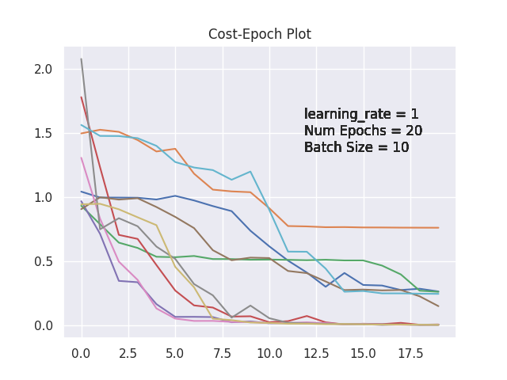

# Simple Neural Network for Multiclass Classification

This repository contains the implementation of a simple neural network for the multiclass classification task. The model
uses Fruits360 dataset and is implemented from scratch, without using any specific machine learning libraries.

## Data

The [Fruits360](https://github.com/antonnifo/fruits-360) dataset is used in this project. It contains ~490 images for
each of the 6 classes, where each image is of
size 100x100. To handle the high dimensionality (10,000 features per image), a feature extractor is used, reducing the
number of features first to 360, then further down to 102. The resulting dataset is saved as pickle files in the '
datasets' folder.

## Neural Network Architecture

- Input Layer: accepts num_features of each dataset sample (102)
- Hidden Layers: two layers with 150 and 60 neurons, respectively, using the sigmoid activation function.
- Output Layer: consists of 6 neurons, which is the number of classes, with a softmax function.

## Dataset Loading

Data is loaded using the `Load_Dataset` function. This function loads four pickle files:

- `train_set_features.pkl`: a 2d array of dimensions 1962x360.
- `test_set_features.pkl`: a 2d array of dimensions 662x360.
- `train_set_labels.pkl` and `test_set_labels.pkl`: 1D arrays containing labels for respective data subsets.

## Feedforward & Backpropagation

Feedforward and Backpropagation are fundamental to Neural Network training. They are used for predicting outputs and
optimizing the weights of the network, respectively.

- Feedforward: Initiated at the input layer, it goes forward to hidden layers and finally produces output.
- Backpropagation: It is the process of updating the weights in a way that minimizes the cost function. The method
  implemented here is a vectorized version of Stochastic Gradient Descent (SGD).

To better understand the training process, cost per epoch is plotted and stored in the `outputs/` directory.

## Momentum

Besides the main training process, momentum is implemented in this project. Momentum is a technique used in the update
step of the Neural Network weights with the goal of accelerating the gradient descent and avoiding local minima.

## Course Information

- **Course**: Computational Intelligence
- **University**: Amirkabir University of Technology
- **Semester**: Fall 2020

Let me know if you have any questions.
